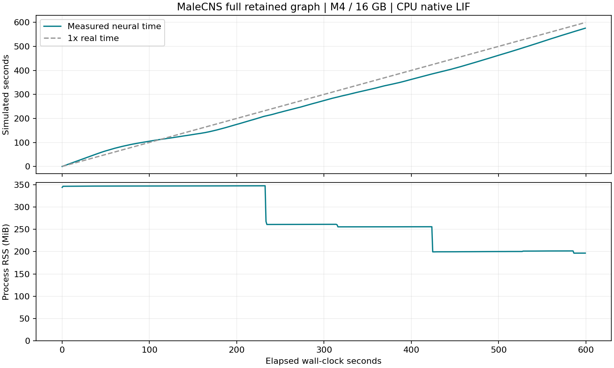
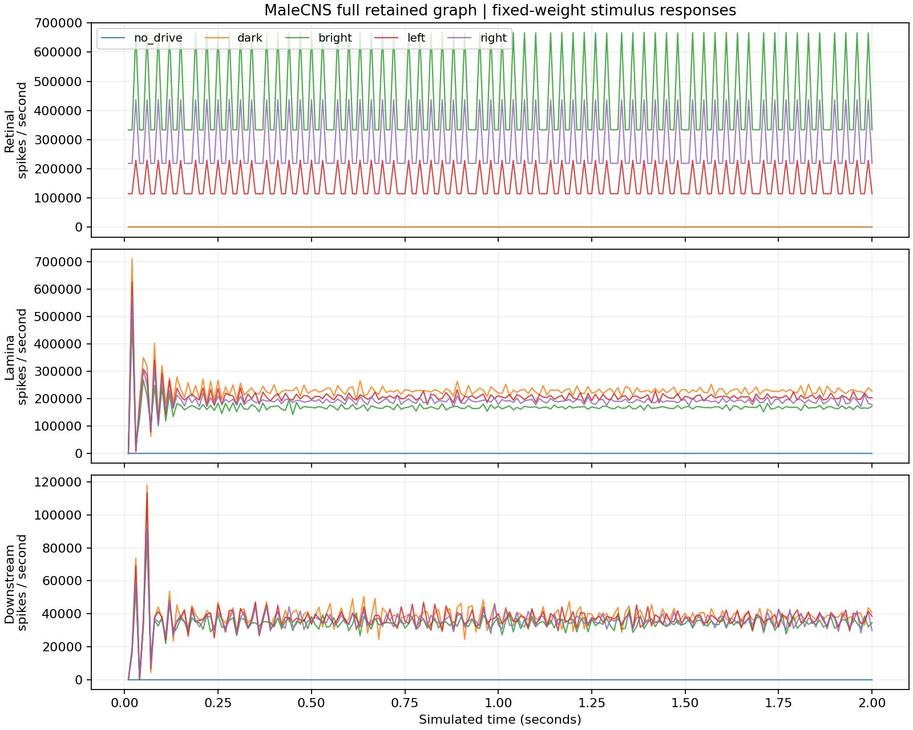

# 本机验收报告：MaleCNS 全连接组仿真

**验收通过。这台 M4、16 GB MacBook Air 可以加载并持续运行完整保留的 MaleCNS v1.0 简化脉冲网络。** 10 分钟真实时间推进了 **576.51 秒模拟时间**，平均速度 **0.961×**；运行峰值常驻内存仅 **347.7 MiB**。当前学习关闭。

测量起始时间：**2026-09-13 11:55:30（上海时间）**。本报告对应本次首次验收；再次运行命令会更新同名 JSON、CSV 和图片，本文数字保留首次验收记录。

## 本机实测

| 项目 | 结果 |
| --- | --- |
| 硬件与系统 | Apple M4；10 核 CPU、8 核 GPU；16 GiB 统一内存；macOS 27.0 |
| 执行环境 | Python 3.11.16；原生 C++ CPU 内核；单个仿真进程；单线程 BLAS |
| 三份官方原始数据 | 1,109,008,094 字节，约 1.109 GB |
| 稀疏连接索引和有效权重 | 205,997,112 字节，约 196.5 MiB |
| 编译后的可加载图文件 | 250,157,214 字节，约 238.6 MiB |
| 下载及校验耗时 | 844.35 秒；包含串行下载后切换分段续传的两段实际执行时间 |
| 下载阶段峰值 RSS | 157.2 MiB |
| 分批导入 | 22.31 秒；峰值 RSS 1.84 GiB |
| 构建运行图 | 3.07 秒；峰值 RSS 1.76 GiB |
| 第一个刺激实验进程从入口到可运行 | 0.832 秒，其中图加载 0.076 秒 |
| 连续运行时长 | 600.000 秒真实时间 |
| 推进的神经时间 | 576.51 秒；共 5,765,100 个 0.1 ms 神经步 |
| 全程平均速度 | 0.961×；约每 1.041 秒真实时间推进 1 秒神经时间 |
| 最后约一分钟速度 | 1.143×，由末尾 59.2 秒的 CSV 观测计算 |
| 持续运行峰值 RSS | 347.7 MiB（0.340 GiB） |
| 平均 CPU 消耗 | 99.6% 的一个 CPU 核心；约一个核心持续计算 |
| 系统交换空间 | 起始 526.25 MiB，结束 518.25 MiB；观测峰值 526.25 MiB |
| 项目当前磁盘占用 | 约 2.42 GiB，含源码、运行及检查环境、原始数据、转换缓存和报告 |
| 本机剩余磁盘空间 | 约 67.2 GiB |

加载测量来自新的 Python 进程，但系统文件缓存已由下载、导入及此前实验预热。RSS 是进程常驻内存；交换空间是整个系统的观测值，与其他应用共享。速度是在本机正常桌面环境下、采用本报告刺激序列的实测结果，未包含赛车画面处理或学习计算。



## 完整性与计算正确性

三份文件均从 [MaleCNS 官方下载源](https://male-cns.janelia.org/download/) 获取，字节数及 SHA-256 与固定上游数据清单一致。原始文件共 **1.109 GB**，所有分段下载临时文件已清理。

- 原始连接表：**151,856,684 行**；导入保留 **166,700 个神经元、25,582,938 条有向连接、124,177,617 个突触接触**。
- 保留了 **10,299,701 条单接触弱连接、101 条自连接、217 个孤立神经元**，没有增加连接强度阈值或按速度删减脑区。
- **33,013 个未解析对象及 11,864 个非神经对象**不作为模拟神经元；它们仍保留在原始文件中。全部源数据的保留与排除计数能够对应。
- **15 项上游测试通过**：连接保留与排除、神经元 ID、递质符号，以及 Brian2 对照中的兴奋和抑制、延迟、不应期、自连接和变化输入。
- 本地三个 Python 入口文件通过 Black、Ruff、mypy 严格类型检查；环境依赖检查通过。

模拟器固定在 [DOOMFLY `71ecf53`](https://github.com/nftechie/doomfly/tree/71ecf53d78eaffaf1a57ed7b0ccf5d458abc9f33)，模型源码未修改；上游输出目录中的内核和图清单已由本机构建结果更新。

## 刺激响应与可复现性

每组试验从相同静息初态开始，持续 2 个模拟秒。图结构、权重、0.1 ms 神经步长及上游参数均保持固定。

| 条件 | 全网放电总数 | 下游放电总数 | 出现放电的神经元数 |
| --- | ---: | ---: | ---: |
| 无外部驱动 | 0 | 0 | 0 |
| 暗场，保留 lamina 驱动 | 536,242 | 76,667 | 8,657 |
| 全亮 | 1,282,888 | 68,046 | 9,926 |
| 左半视野亮 | 789,441 | 73,833 | 9,074 |
| 右半视野亮 | 1,031,310 | 71,309 | 9,520 |
| 重复全亮 | 1,282,888 | 68,046 | 9,926 |

无外部驱动时，全网无放电。亮场和暗场使 **1,306 个下游神经元**的放电计数发生变化；左右刺激使 **1,309 个下游神经元**的计数不同。这里的“下游”排除了直接施加电流的视网膜及 lamina 神经元。

重复全亮实验中，**全部 166,700 个神经元、200 个 10 ms 观察窗的放电计数，以及最终电位和突触状态均完全一致**。所有实验及十分钟运行的状态检查均未发现非有限数值。



## 运行与下一步

在项目目录执行：

```sh
./flybrain smoke
./flybrain benchmark --wall-seconds 600
```

需要重建数据缓存时使用 `./flybrain prepare`。模型、源数据和依赖均在本地，刺激和性能实验可离线运行。详细步骤见 [启动说明](../README.md)。十分钟验收进程已经正常退出。

本阶段确认了本机运行能力、刺激响应和重复性。当前接线来源于生物重建，LIF 动力学、递质符号和视觉投影采用固定上游假设；**学习尚未开启**。之后的赛车实验需要单独设计感觉输入、控制读出、奖励和可塑性规则，并用对照实验验证训练改善。

原始证据：[硬件](hardware.json)、[数据文件清单](data-manifest.json)、[连接完整性](integrity.json)、[数值与代码检查](code-validation.json)、[刺激实验](smoke.json)、[运行指标](benchmark.json)、[逐秒运行记录](benchmark.csv)、[空间占用](storage.json)。
